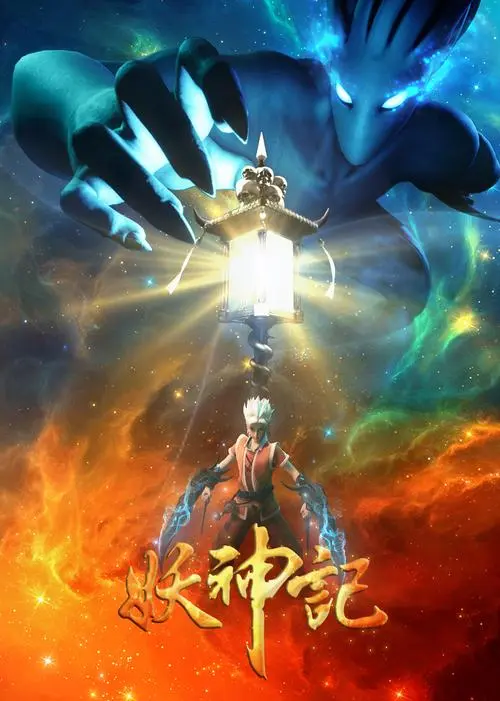

# 追番笔记

> **此处是从2018年7月28日开始记录的追番日期，作为回顾（和推荐）。**

* 2018年7月28日

  刀剑神域第一季（艾恩葛朗特篇、妖精之舞篇），刀剑神域第二季（幽灵子弹篇），刀剑神域外传

	

* 2018年7月28日

  进击的巨人第一季（有剧透不概括），进击的巨人第二季（有剧透不概括）

	

* 2018年7月28日

  侠岚第一季（振翼篇），第二季（云见篇），第三季（鸣风篇），第四季（若星篇），第五季（凌霜篇），第六季（决敌篇）

	

* 2018年7月28日

  妖怪旅店营业中

	

* 2018年7月28日

  Overlord第一季，Overlord第二季，Overlord第三季

	

* 2018年7月28日

  干物妹，小埋！（第一季），干物妹！小埋R（第二季）

	

* 2018年7月28日

  东京喰种第一季（Tokyo Ghoul），东京喰种第二季（Tokyo Ghoul √A），东京喰种第三季（Tokyo Ghoul:re）

	

* 2018年7月28日

  武庚纪之逆天之决（第一季），武庚纪之天启（第二季）

	

* 2018年8月12日

  进击的巨人第三季part1，死神，枪神记第一季（特工学院篇1-12集），枪神记第二季（特工世界篇13-24集），枪神记第三季（血族秘史篇25-36集）

	​

* 2018年11月2日

  画江湖之不良人第一季（1-54集），画江湖之不良人第二季（1-40集）

	​

* 2018年12月21日

  妖神记第一季（1-40集），妖神记第二季（41-80集），妖神记之影妖篇（第三季，81-120集），食戟之灵第一季（1-24集），食戟之灵第二季（1-13集 贰之皿），食戟之灵第三季（餐之皿 上半1-12集+下半13-24集 远月列车篇）

  

  ​

* 2018年12月22日

  镇魂街第一季（1-24集）

  ​

* 2018年12月23日

  寄生兽（1-24集），全职高手第一季（1-12集）

  ​

* 2018年12月25日

  东京喰种re第二季（第四季完结，1-12集）

  ​
* 2019年1月2日

  埃罗芒阿老师（1-12集+OVA1-2）

  ​

* 2019年1月5日

  Re：从零开始的异世界生活第一季（1-25集）

  ​

* 2019年1月8日

  路人女主的养成方法第一季（1-13集）、第二季（1-12集）

  ​

* 2019年1月23日

  一人之下第一季（1-12集）、第二季（1-24集+番外）

  ​

* 2019年1月31日

  理想禁区（1-12集，中日合作动画已下架，结局改过，漫画这个2019.1.31这个时间点还在连载）

  ​

* 2019年2月12日

  星辰变第一季（1-12集）

  ​

* 2019年2月17日

  斗破苍穹第一季（1-12集）、第二季（1-12集）

  ​

* 2019年2月26日

  小林家的龙女仆第一季（1-13集+OVA1）

  ​

* 2019年3月12日

  家有女友（1-12集）

  ​

* 2019年3月14日

  亚人第一季（1-13集）、第二季（1-13集）+OVA3集

  ​

* 2019年3月19日

  五等分的新娘第一季（1-12集）

  ​

* 2019年4月5日

  梦塔·雪谜城第一季（1-12集+前传）

  ​

* 2019年4月6日

  武动乾坤第一季（1-12集）

  ​

* 2019年4月7日

  玉子爱情故事

  ​

* 2019年4月9日

  萌妻食神第一季（1-36集）

  ​

* 2019年4月16日

  Charlotte（1-14集）

  ​

* 2019年5月2日

  声之形

  ​

* 2019年5月3日

  斗破苍穹特别篇1（云芝篇）、斗破苍穹特别篇2（沙之澜歌）

  ​

* 2019年5月15日

  风语咒（动画电影）

  ​

‍

‍

‍

‍

‍

‍

[动漫.txt](assets/动漫-20221027165348-apf3mtm.txt)

‍
